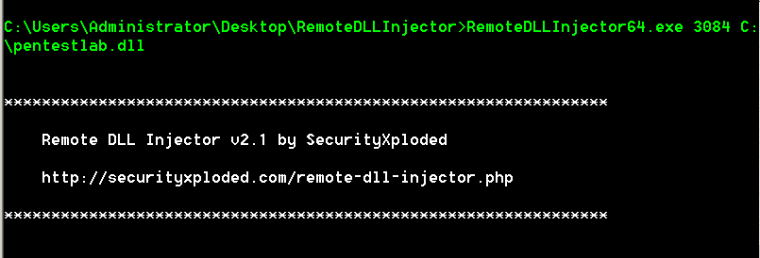
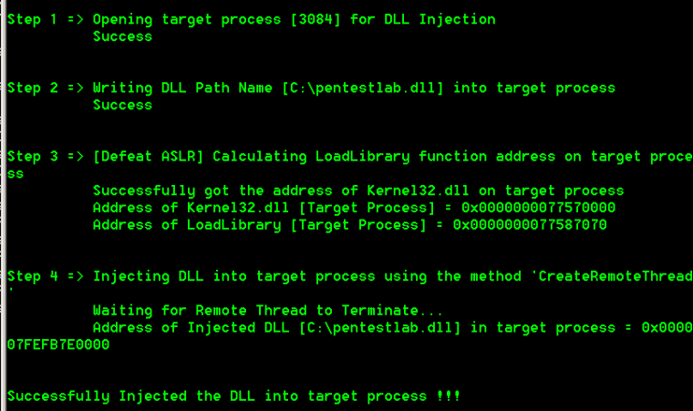
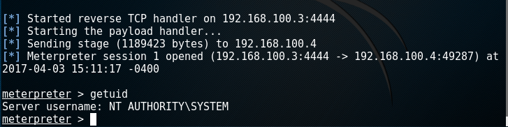

### Introduction

This is a tools which can be used to dll injection：

 

From the moment that RemoteDLLInjector executes will provide the full steps that performs in order to achieve DLL injection.

If the DLL is successfully injected it will return back a meterpreter session with the privileges of the process. Therefore processes with higher privileges than the standard can be abused for privilege escalation.

